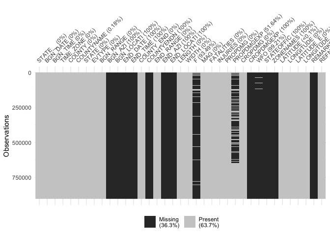
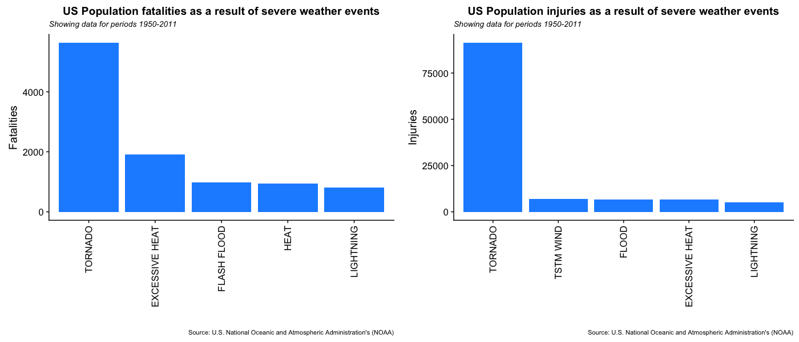
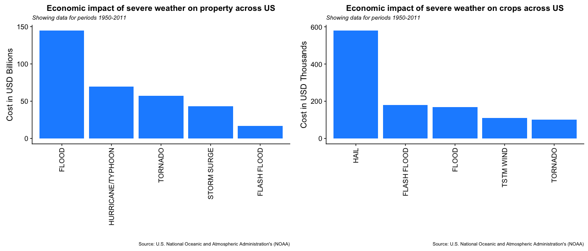

# Severe Weather Event Impact Analysis


## Synopsis
This project involves exploring the U.S. National Oceanic and Atmospheric Administration's (NOAA) storm database. This database tracks characteristics of major storms and weather events in the United States, including when and where they occur, as well as estimates of any fatalities, injuries, and property damage. The two key questions addressed in this project are:  
1. Which types of weather events are most harmful with respect to population health in the US and  
2. Which types of weather events have the greatest economic consequences in the US.  
These questions will be addressed through a combination of exploratory data analysis of the NOAA dataset and ensuring any analysis steps could be fully reproducible by independent researchers.

# Data Processing
This section contain the steps to load the NOAA dataset and prepare it for analysis. The code and associated comments illustrate the process carried out to ingest and transform the initial dataset up to the point where it is ready to support the analysis stage.

## External libraries
The following external libraries are required to be loaded in order to proceed with the execution of this analysis.


```r
library(readr, warn.conflicts = FALSE)
library(dplyr, warn.conflicts = FALSE)
library(naniar, warn.conflicts = FALSE)
library(ggplot2, warn.conflicts = FALSE)
library(cowplot, warn.conflicts = FALSE)
```

```
## Warning: package 'cowplot' was built under R version 3.5.2
```

## Dataset download
This section checks if the NOAA dataset file exists in the project folder. If not, it attempts to download a fresh file version from the URL provided in the global parameters. 

The cache in this code chunk is turned on to improve processing times in case of multiple executions.


```r
if(!file.exists("repdata_data_StormData.csv.bz2")){
        download.file(params$data_file, "repdata_data_StormData.csv.bz2")
}

NOAA <- read_csv("repdata_data_StormData.csv.bz2", col_names = TRUE)
```

## Dataset structure checks
We are told that the original dataset contains **902297 records/observations and 37 variables**. In this section, we seek to confirm whether the downloaded dataset is complete i.e. contains the observations and variables expected as well as understanding which variables are complete or incomplete, so this could be taken into consideration during further steps of this analysis.


```r
# Check dataset structure
glimpse(NOAA)
```

```
## Observations: 902,297
## Variables: 37
## $ STATE__    <dbl> 1, 1, 1, 1, 1, 1, 1, 1, 1, 1, 1, 1, 1, 1, 1, 1, 1, ...
## $ BGN_DATE   <chr> "4/18/1950 0:00:00", "4/18/1950 0:00:00", "2/20/195...
## $ BGN_TIME   <chr> "0130", "0145", "1600", "0900", "1500", "2000", "01...
## $ TIME_ZONE  <chr> "CST", "CST", "CST", "CST", "CST", "CST", "CST", "C...
## $ COUNTY     <dbl> 97, 3, 57, 89, 43, 77, 9, 123, 125, 57, 43, 9, 73, ...
## $ COUNTYNAME <chr> "MOBILE", "BALDWIN", "FAYETTE", "MADISON", "CULLMAN...
## $ STATE      <chr> "AL", "AL", "AL", "AL", "AL", "AL", "AL", "AL", "AL...
## $ EVTYPE     <chr> "TORNADO", "TORNADO", "TORNADO", "TORNADO", "TORNAD...
## $ BGN_RANGE  <dbl> 0, 0, 0, 0, 0, 0, 0, 0, 0, 0, 0, 0, 0, 0, 0, 0, 0, ...
## $ BGN_AZI    <lgl> NA, NA, NA, NA, NA, NA, NA, NA, NA, NA, NA, NA, NA,...
## $ BGN_LOCATI <lgl> NA, NA, NA, NA, NA, NA, NA, NA, NA, NA, NA, NA, NA,...
## $ END_DATE   <lgl> NA, NA, NA, NA, NA, NA, NA, NA, NA, NA, NA, NA, NA,...
## $ END_TIME   <lgl> NA, NA, NA, NA, NA, NA, NA, NA, NA, NA, NA, NA, NA,...
## $ COUNTY_END <dbl> 0, 0, 0, 0, 0, 0, 0, 0, 0, 0, 0, 0, 0, 0, 0, 0, 0, ...
## $ COUNTYENDN <lgl> NA, NA, NA, NA, NA, NA, NA, NA, NA, NA, NA, NA, NA,...
## $ END_RANGE  <dbl> 0, 0, 0, 0, 0, 0, 0, 0, 0, 0, 0, 0, 0, 0, 0, 0, 0, ...
## $ END_AZI    <lgl> NA, NA, NA, NA, NA, NA, NA, NA, NA, NA, NA, NA, NA,...
## $ END_LOCATI <lgl> NA, NA, NA, NA, NA, NA, NA, NA, NA, NA, NA, NA, NA,...
## $ LENGTH     <dbl> 14.0, 2.0, 0.1, 0.0, 0.0, 1.5, 1.5, 0.0, 3.3, 2.3, ...
## $ WIDTH      <dbl> 100, 150, 123, 100, 150, 177, 33, 33, 100, 100, 400...
## $ F          <dbl> 3, 2, 2, 2, 2, 2, 2, 1, 3, 3, 1, 1, 3, 3, 3, 4, 1, ...
## $ MAG        <dbl> 0, 0, 0, 0, 0, 0, 0, 0, 0, 0, 0, 0, 0, 0, 0, 0, 0, ...
## $ FATALITIES <dbl> 0, 0, 0, 0, 0, 0, 0, 0, 1, 0, 0, 0, 1, 0, 0, 4, 0, ...
## $ INJURIES   <dbl> 15, 0, 2, 2, 2, 6, 1, 0, 14, 0, 3, 3, 26, 12, 6, 50...
## $ PROPDMG    <dbl> 25.0, 2.5, 25.0, 2.5, 2.5, 2.5, 2.5, 2.5, 25.0, 25....
## $ PROPDMGEXP <chr> "K", "K", "K", "K", "K", "K", "K", "K", "K", "K", "...
## $ CROPDMG    <dbl> 0, 0, 0, 0, 0, 0, 0, 0, 0, 0, 0, 0, 0, 0, 0, 0, 0, ...
## $ CROPDMGEXP <lgl> NA, NA, NA, NA, NA, NA, NA, NA, NA, NA, NA, NA, NA,...
## $ WFO        <lgl> NA, NA, NA, NA, NA, NA, NA, NA, NA, NA, NA, NA, NA,...
## $ STATEOFFIC <lgl> NA, NA, NA, NA, NA, NA, NA, NA, NA, NA, NA, NA, NA,...
## $ ZONENAMES  <lgl> NA, NA, NA, NA, NA, NA, NA, NA, NA, NA, NA, NA, NA,...
## $ LATITUDE   <dbl> 3040, 3042, 3340, 3458, 3412, 3450, 3405, 3255, 333...
## $ LONGITUDE  <dbl> 8812, 8755, 8742, 8626, 8642, 8748, 8631, 8558, 874...
## $ LATITUDE_E <dbl> 3051, 0, 0, 0, 0, 0, 0, 0, 3336, 3337, 3402, 3404, ...
## $ LONGITUDE_ <dbl> 8806, 0, 0, 0, 0, 0, 0, 0, 8738, 8737, 8644, 8640, ...
## $ REMARKS    <lgl> NA, NA, NA, NA, NA, NA, NA, NA, NA, NA, NA, NA, NA,...
## $ REFNUM     <dbl> 1, 2, 3, 4, 5, 6, 7, 8, 9, 10, 11, 12, 13, 14, 15, ...
```

```r
# Check entire dataset for missing data that could cause deviations during analysis
miss_dt <- miss_var_summary(NOAA)
vis_miss(NOAA, warn_large_data = FALSE)
```

<!-- -->

**NOTE:** if the above ouput does not show that the this dataset is composed of **902297 observations and 37 variables**, then there may be the case that the file is corrupt or a problem happened during the download of the datsaset. This should be fixed before proceeding with the analysis.

## Dataset tidying and reduction
Around 36.3% of records are missing and showing the value "NA" - not available. For this analysis in particular, only a small number of the variables will be required and these will be saved in a new data frame (rNOAA) and the existing full dataset deleted to free computational resources. The code used for this is as follows:


```r
rNOAA <- NOAA %>%
        select(STATE_ID = STATE__, BGN_DATE:EVTYPE, FATALITIES, INJURIES, PROPDMG:CROPDMGEXP)
###
rm(NOAA)
```

# Analysis
In this analysis the researcher seeks to find answers to the following questions: 

1. Across the United States, which types of events are most harmful with respect to population health?  
2. Across the United States, which types of events have the greatest economic consequences?  

## Top events with impact on population health across US
The dataset contains two variables related with the quantification of the impact on population health by severe weather events, they are: *number of fatalities* and *number of injuries*. Given the extense number of weather events, this analysis will display only the 5 events with most impact in terms of each variable - fatalities and injuries.

For population fatalities, the 5 most impactful events are summarised by the following code:


```r
# Overall top5 events by number of fatalities
top5_fatalities <- rNOAA %>%
        select(EVTYPE, FATALITIES) %>%
        group_by(EVTYPE) %>%
        summarise(FATALITIES = sum(FATALITIES)) %>%
        top_n(5, FATALITIES) %>%
        arrange(desc(FATALITIES)) %>%
        print
```

```
## # A tibble: 5 x 2
##   EVTYPE         FATALITIES
##   <chr>               <dbl>
## 1 TORNADO              5633
## 2 EXCESSIVE HEAT       1903
## 3 FLASH FLOOD           978
## 4 HEAT                  937
## 5 LIGHTNING             816
```

For injuries, the 5 most impactful events are summarised below:


```r
# Overall top5 events by number of injuries
top5_injuries <- rNOAA %>%
        select(EVTYPE, INJURIES) %>%
        group_by(EVTYPE) %>%
        summarise(INJURIES = sum(INJURIES)) %>%
        top_n(5, INJURIES) %>%
        arrange(desc(INJURIES)) %>%
        print
```

```
## # A tibble: 5 x 2
##   EVTYPE         INJURIES
##   <chr>             <dbl>
## 1 TORNADO           91346
## 2 TSTM WIND          6957
## 3 FLOOD              6789
## 4 EXCESSIVE HEAT     6525
## 5 LIGHTNING          5230
```

The final summary and visualisation of the 5 events with most impact on population health across US is as follows:


```r
# Top 5 fatalities plot object
fatalities.pl <- ggplot(top5_fatalities, aes(x = reorder(EVTYPE, -FATALITIES), y =  FATALITIES)) +
        geom_bar(stat = "identity", fill = "dodgerblue") +
        labs(title = "US Population fatalities as a result of severe weather events") +
        theme(plot.title = element_text(face = "bold", size = 14)) +
        theme(axis.text.x = element_text(angle=90, vjust=0.5, hjust=1)) +
        labs(subtitle = "Showing data for periods 1950-2011") +
        theme(plot.subtitle = element_text(face = "italic", size = 10)) +
        labs(x = "", y = "Fatalities") +
        labs(caption = "Source: U.S. National Oceanic and Atmospheric Administration's (NOAA)") +
        theme(plot.caption = element_text(face = "plain", size = 8)) 

# Top 5 injuries plot object
injuries.pl <- ggplot(top5_injuries, aes(x = reorder(EVTYPE, -INJURIES), y =  INJURIES)) +
        geom_bar(stat = "identity", fill = "dodgerblue") +
        labs(title = "US Population injuries as a result of severe weather events") +
        theme(plot.title = element_text(face = "bold", size = 14)) +
        theme(axis.text.x = element_text(angle=90, vjust=0.5, hjust=1)) +
        labs(subtitle = "Showing data for periods 1950-2011") +
        theme(plot.subtitle = element_text(face = "italic", size = 10)) +
        labs(x = "", y = "Injuries") +
        labs(caption = "Source: U.S. National Oceanic and Atmospheric Administration's (NOAA)") +
        theme(plot.caption = element_text(face = "plain", size = 8)) 

plot_grid(fatalities.pl,injuries.pl, align = "h", ncol = 2, rel_widths = c(1/2, 1/2))
```

<!-- -->

```r
ggsave("NOAA_Analysis_files/figure-html/pop_health_plot-1.png", width=14, height=6, dpi=100)
```


## Top events with most economic consequences across US
In this second question, we will look at the economic impact of severe weather events across the US. For this, the dataset provides two numeric variables with the economic impact of severe weather, these are:  

1. Property damage (PROPDMG)  
2. Crops damage (CROPDMG)

With each of the numeric variables, there is a one character variable indicating the exponent of the base variable:  

1. The property damage exponent is *PROPDMEXP*  
-- Values: K, M, NA, B, m, +, 0, 5, 6, ?, 4, 2, 3, h, 7, H, -, 1, 8  
2. The crop damage exponent is *CROPDMGEXP*  
-- Values: NA, FALSE

To get to the final dollar value, it is required to multiply the base value with the respective exponent value. 

H,h = hundreds = 100

K,k = kilos = thousands = 1,000

M,m = millions = 1,000,000

B,b = billions = 1,000,000,000

(+) = 1

(-) = 0

(?) = 0

black/empty character = 0

numeric 0..8 = 10

The following links provide further information on how to parse the EXP values.  
 
[Coursera Instructions](https://www.coursera.org/learn/reproducible-research/discussions/weeks/4/threads/38y35MMiEeiERhLphT2-QA)  

[How To Handle Exponent Value of PROPDMGEXP and CROPDMGEXP](https://rstudio-pubs-static.s3.amazonaws.com/58957_37b6723ee52b455990e149edde45e5b6.html)  

The strategy followed in this analysis is to only consider exponent with letters (K or k, M or m, B or b, H or h) or numbers. Everything else is not considered as total numbers are irrelevant for the questions being answered.

The following code is used to determine the 5 most costly weather events in terms of property damage.

```r
top5_property <- rNOAA %>%
        select(EVTYPE, PROPDMG, PROPDMGEXP) %>%
        filter(PROPDMGEXP %in% c(letters, LETTERS, "0":"9")) %>%
        mutate(Prop_Exp = case_when(
                PROPDMGEXP == "K" | PROPDMGEXP == "k" ~ 10^3,
                PROPDMGEXP == "M" | PROPDMGEXP == "m" ~ 10^6,
                PROPDMGEXP == "B" | PROPDMGEXP == "b" ~ 10^9,
                PROPDMGEXP == "H" | PROPDMGEXP == "h" ~ 10^2,
                TRUE ~ 10^as.numeric(PROPDMGEXP))) %>%
        mutate(Dollars = PROPDMG * Prop_Exp) %>%
        group_by(EVTYPE) %>%
        summarise(Dollars = sum(Dollars)) %>%
        top_n(5, Dollars) %>%
        arrange(desc(Dollars)) %>%
        print
```

```
## # A tibble: 5 x 2
##   EVTYPE                  Dollars
##   <chr>                     <dbl>
## 1 FLOOD             144657709800 
## 2 HURRICANE/TYPHOON  69305840000 
## 3 TORNADO            56947380614.
## 4 STORM SURGE        43323536000 
## 5 FLASH FLOOD        16822723772.
```

To quantify the dollar value of crops damage, the same procdure should be followe. However, it is found that the exponent factors in the variable *CROPDMGEXP* only contain "NA" and "FALSE" values i.e. NA, FALSE

Because of this, the exponents will not be used in the derivation of Crops damage value.


```r
top5_crop <- rNOAA %>%
        select(EVTYPE, CROPDMG) %>%
        group_by(EVTYPE) %>%
        summarise(Dollars = sum(CROPDMG)) %>%
        top_n(5, Dollars) %>%
        arrange(desc(Dollars)) %>%
        print
```

```
## # A tibble: 5 x 2
##   EVTYPE      Dollars
##   <chr>         <dbl>
## 1 HAIL        579596.
## 2 FLASH FLOOD 179200.
## 3 FLOOD       168038.
## 4 TSTM WIND   109203.
## 5 TORNADO     100019.
```

The final summary and visualisation of the impact of the 5 most costly events (in USD) related with property and crops damage across the US as a result of weather events is as follows:


```r
property.pl <- ggplot(top5_property, aes(x = reorder(EVTYPE, -Dollars), y =  Dollars*10^-9)) +
        geom_bar(stat = "identity", fill = "dodgerblue") +
        labs(title = "Economic impact of severe weather on property across US") +
        theme(plot.title = element_text(face = "bold", size = 14)) +
        theme(axis.text.x = element_text(angle=90, vjust=0.5, hjust=1)) +
        labs(subtitle = "Showing data for periods 1950-2011") +
        theme(plot.subtitle = element_text(face = "italic", size = 10)) +
        labs(x = "", y = "Cost in USD Billions") +
        labs(caption = "Source: U.S. National Oceanic and Atmospheric Administration's (NOAA)") +
        theme(plot.caption = element_text(face = "plain", size = 8)) 

crops.pl <- ggplot(top5_crop, aes(x = reorder(EVTYPE, -Dollars), y =  Dollars*10^-3)) +
        geom_bar(stat = "identity", fill = "dodgerblue") +
        labs(title = "Economic impact of severe weather on crops across US") +
        theme(plot.title = element_text(face = "bold", size = 14)) +
        theme(axis.text.x = element_text(angle=90, vjust=0.5, hjust=1)) +
        labs(subtitle = "Showing data for periods 1950-2011") +
        theme(plot.subtitle = element_text(face = "italic", size = 10)) +
        labs(x = "", y = "Cost in USD Thousands") +
        labs(caption = "Source: U.S. National Oceanic and Atmospheric Administration's (NOAA)") +
        theme(plot.caption = element_text(face = "plain", size = 8)) 
        
plot_grid(property.pl, crops.pl, align = "h", ncol = 2, rel_widths = c(1/2, 1/2))
```

<!-- -->

```r
ggsave("NOAA_Analysis_files/figure-html/PropCropdmg_dollars-1.png", width=14, height=6, dpi=100)
```


# Results

From the analysis carried out, one can determine that Tornados are the single most impactfull weather event in terms of both population fatalities and injuries.

Flood tops the ranking of events creating the most economical damage on property as a result of severe weather. The most costly damage on crops comes from hail storms. Note that even the most costly event on crops is below the cost of properties and therefore if these two categories are combined, the cost with crops damage would not show in the top 5 ranking.

Overall, Tornados seem to be the event showing on all the four categories under analysis: population fatalities, population injuries, property damage and crops damage.


